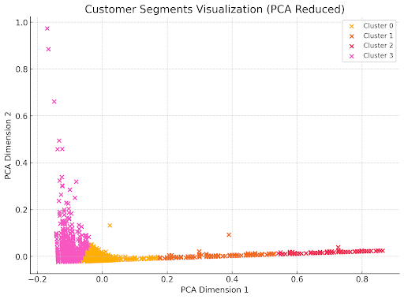
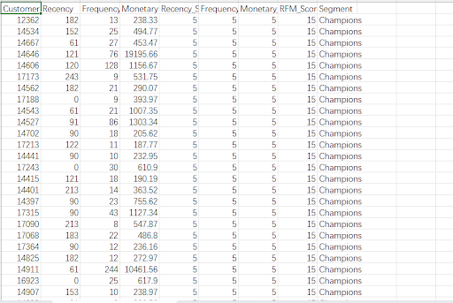
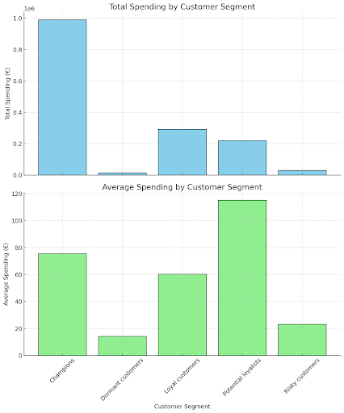

# Online Retail Customer Segmentation

## Business Question
How can customer segmentation improve marketing efficiency and increase customer retention?

### Problem Statement
Currently, the e-commerce company employs a one-size-fits-all marketing approach, resulting in suboptimal engagement. This project aims to:
1. Identify valuable customer segments.
2. Design targeted marketing strategies.
3. Improve overall business outcomes.

---

## Data Analysis Process

The project followed a structured data analysis pipeline:
1. **Data Cleaning**:
    - Removed duplicates and erroneous entries.
    - Merged similar product names for consistency.
2. **Segmentation Methods**:
    - **RFM Analysis**: Recency, Frequency, Monetary value scoring.
    - **K-Means Clustering**: To identify distinct customer groups.
3. **Visualization**:
    - Spending habits by customer group.
    - Seasonal product purchasing trends.
    - Cluster analysis results.

---

## Visualizations

This project includes detailed visualizations to represent customer segmentation and spending trends. Below are some of the key visual outputs:

### 1. Customer Segments Visualization

This visualization shows the customer clusters created using K-Means clustering after dimensionality reduction with PCA. Each cluster represents a distinct customer group based on RFM metrics:
- **Cluster 0 (Yellow):** High Recency, Frequency, and Monetary value – Loyal and active customers.
- **Cluster 1 (Orange):** Medium Recency, Frequency, and Monetary value – Customers with moderate engagement.
- **Cluster 2 (Red):** Low Recency and Frequency – Customers at risk of churn.
- **Cluster 3 (Pink):** Low activity across all metrics – Dormant customers.

---

### 2. RFM Score Breakdown

This table provides an example of customers categorized as **Champions** based on their RFM scores:
- **Recency (5):** Recent purchases.
- **Frequency (5):** Frequent buyers.
- **Monetary (5):** High spending.
- **RFM Score (15):** Indicates the highest value customers who are actively contributing to the business.

---

### 3. Total and Average Spending by Customer Segment

These bar charts depict:
1. **Total Spending by Segment:** Highlights that Champions contribute the highest total revenue.
2. **Average Spending by Segment:** Potential Loyalists show the highest average spending per transaction, indicating high potential for future loyalty.

---

## Data Dictionary

The **Data Dictionary** provides detailed documentation of the dataset used in this project. It helps users understand the structure, meaning, and data types of each field.

### Contents
- **Field Descriptions**: Clear explanation of each attribute in the dataset, such as:
  - `CustomerID`: Unique identifier for each customer.
  - `InvoiceNo`: Transaction identifier.
  - `UnitPrice`: Price per unit of product.
  - `Quantity`: Number of units purchased.
- **Data Types**: Details of data formats (e.g., Integer, String, Decimal).
- **Sample Values**: Example entries for clarity.
- **Critical Fields**: Highlights fields essential for segmentation and analysis.
- **Privacy Notes**: Sensitive data and anonymization considerations.

The complete data dictionary is available in the `data/` folder:  
- [data_dictionary.csv](data/data_dictionary.csv)

---

## Key Insights

### Segmentation
- **Champions**: High-value, loyal customers.
- **Potential Loyalists**: New customers with high engagement.
- **Risky Customers**: Previously valuable, now disengaged.

### Spending Trends
- Champions have high total spending, while Potential Loyalists exhibit the highest average spending.

### Seasonal Trends
- Sales peak during holiday seasons (e.g., Christmas, Halloween).

### Promotions
- Targeted promotions based on customer segment characteristics.

---

## Repository Structure
- **`data/`**: Raw and cleaned datasets, including the data dictionary.
- **`analysis/`**: Segmentation report and visualizations.
- **`code/`**: Scripts and notebooks for analysis.
- **`assets/`**: Conceptual, logical, and physical data models.

---

## Tools and Technologies
- **Python**: For RFM analysis and clustering.
- **Google Sheets**: Data management.

---

## Lessons Learned
- The importance of thorough data cleaning.
- Using customer segmentation to improve resource allocation.
- Addressing ethical considerations in data analysis.

---

## Contributors
- **Kaan Tokmak**
- **Arsenii Popenko**
- **Zizhao Cheng**
